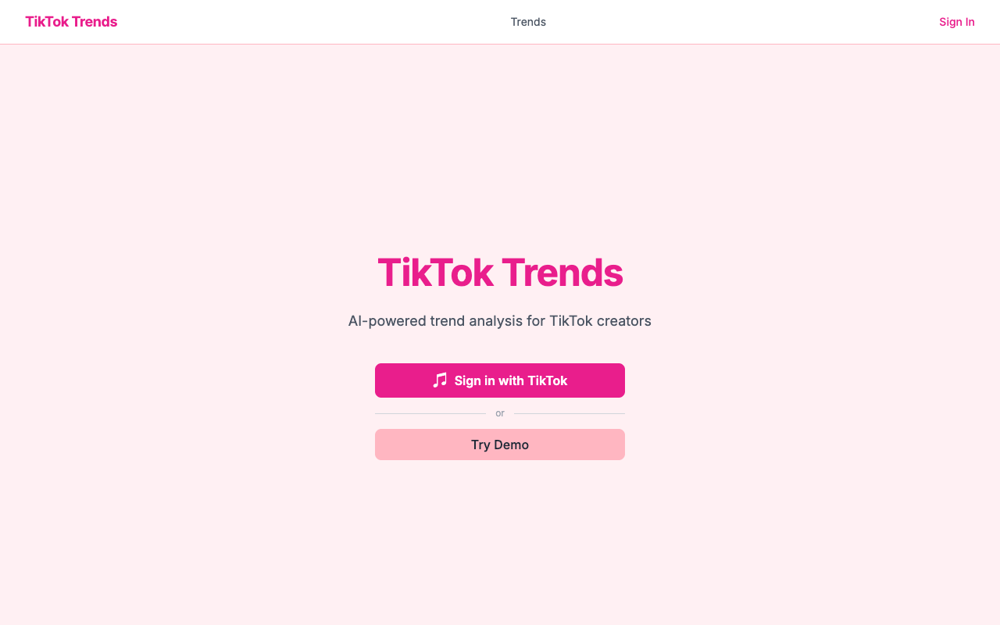
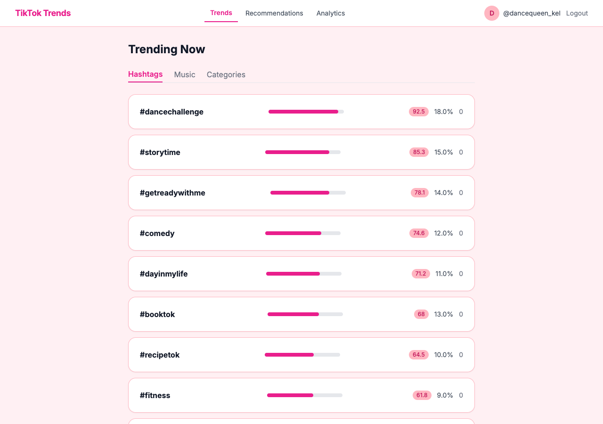
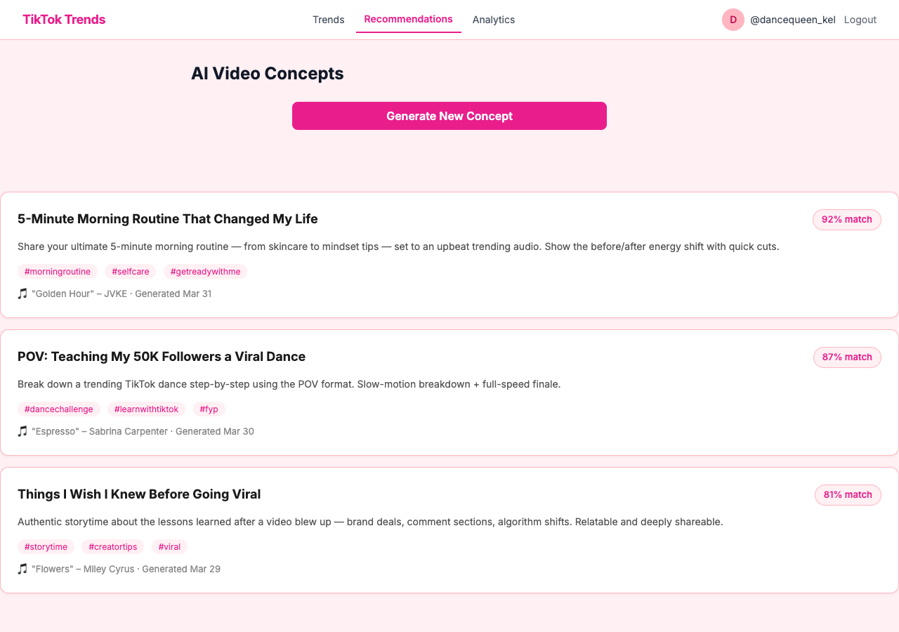
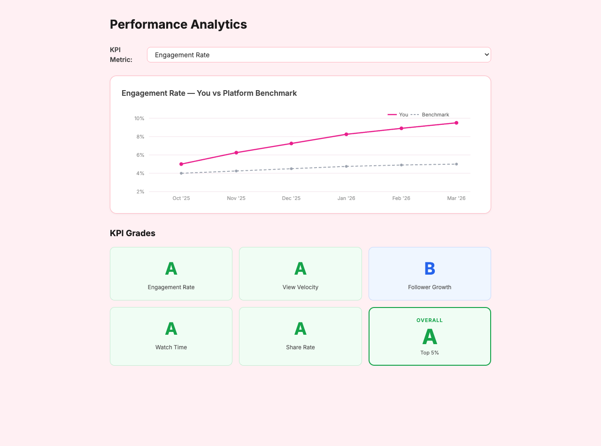

# TikTok Trends Dashboard

An AI-powered analytics platform for TikTok content creators. Connect your TikTok account to get real-time trend intelligence, performance benchmarks, and AI-generated video concepts tailored to your niche.



---

## What It Does

Most TikTok creators post based on intuition. This dashboard replaces guesswork with data — showing which hashtags, sounds, and content categories are gaining velocity *right now*, how your account metrics compare against platform benchmarks, and what your next video should be.

---

## Features

### Sign in with TikTok
Connect your TikTok account via OAuth in one click. No passwords. The moment you authorize, your follower count, engagement rate, video performance, and watch-time data are pulled directly from TikTok and stored for analysis.

A **Try Demo** mode is available for visitors who want to explore the dashboard without a TikTok account.

---

### Trending Now (Public)
A real-time feed of what's gaining traction on TikTok, refreshed every 2 hours from the TikTok Research API.

Three tabs:
- **Hashtags** — top hashtags ranked by velocity score (week-over-week growth rate), with per-hashtag engagement averages and view counts
- **Music** — trending audio tracks sorted by how fast they're being adopted
- **Categories** — content categories (fitness, cooking, comedy, etc.) sorted by momentum

Each trend row shows a **velocity bar** — a visual indicator of how fast the trend is accelerating — alongside the raw engagement and view numbers. Velocity score is week-over-week growth rate; a score of 85 means the hashtag grew 85% in usage in the past 7 days.

No login required to browse trends.



---

### AI Video Concepts
Generate a fully-formed video idea tailored to your niche and current TikTok trends in one click.

Click **Generate New Concept** and the app:
1. Pulls the top 5 trending hashtags currently active on TikTok
2. Combines them with your creator niche (e.g. "fitness", "cooking", "gaming")
3. Sends a structured prompt to **Claude** (Anthropic's AI model)
4. Returns a complete video concept including:
   - **Concept title** — a catchy, under-10-word hook
   - **Description** — 2–3 sentences on exactly what to film and how to frame it
   - **Suggested music** — a specific trending sound that fits the concept
   - **Hashtags** — 5 recommended hashtags to maximize reach
   - **Confidence score** — how well this concept aligns with current trend data (color-coded: green ≥ 80%, yellow ≥ 60%, red below)

Previous recommendations are saved and displayed below the generate button so you can track what you've been suggested over time.



---

### Performance Analytics
A personal analytics dashboard that compares your TikTok KPIs against platform-wide benchmarks — the same way a data team at a creator agency would analyze an account.

**Chart** — A dual-line time series chart (6 months of weekly data) showing:
- Your metric over time (solid pink line)
- The platform average for the same period (dashed gray line)

Switch between five metrics using the dropdown:
- **Engagement Rate** — (likes + comments + shares) / views
- **View Velocity** — week-over-week view growth rate (%)
- **Follower Growth Rate** — week-over-week follower growth rate (%)
- **Avg Watch Time %** — how much of your videos people watch on average
- **Share Rate** — shares / views

**Grade Scorecard** — Below the chart, every KPI is graded A–F by comparing your most recent snapshot to the current platform benchmark:

| Grade | Meaning |
|-------|---------|
| A | ≥ 120% of benchmark |
| B | ≥ 100% of benchmark |
| C | ≥ 80% of benchmark |
| D | ≥ 60% of benchmark |
| F | < 60% of benchmark |

Watch time is graded on an absolute scale (A ≥ 75%, B ≥ 60%, C ≥ 45%, D ≥ 30%) since it's not relative to a platform average.

An **Overall** grade summarizes all five KPIs into a single letter grade. This is what you'd show a brand partnership manager.



---

## Tech Stack

| Layer | Technology |
|-------|-----------|
| Frontend | React 18 + Vite + Tailwind CSS |
| Backend | Java 21 + Spring Boot 3.2 |
| Database | PostgreSQL + Flyway migrations |
| Cache | Redis (1-hour TTL on trend queries) |
| AI | Claude API (`claude-sonnet-4-20250514`) |
| Auth | TikTok OAuth 2.0 (Login Kit) + JWT |
| Data Source | TikTok Research API |
| API Docs | Swagger / OpenAPI |
| Build | Maven |

---

## Architecture

```
React (localhost:3000)
       │
       ▼
Spring Boot API (localhost:8080)
       │
  ┌────┴──────────────────────────┐
  │                               │
Ingestion Scheduler           Recommendation Engine
(CRON every 2h)               (on user request)
  │                               │
TikTok Research API           Claude API
  │                               │
PostgreSQL ◄────────────────────-─┘
  │
Redis Cache
```

**Data pipeline:**
1. `IngestionScheduler` runs every 2 hours, queries the TikTok Research API for recent videos, aggregates them into `Trend` records, and computes platform-wide `TrendBenchmark` averages
2. For each authenticated user, the scheduler refreshes their TikTok OAuth token if needed, fetches their current account stats, computes 5 KPIs, saves a `UserPerformanceSnapshot`, and auto-grades it against the latest benchmark
3. All trend queries are Redis-cached for 1 hour; cache is evicted on each ingestion run

---

## API Reference

| Method | Endpoint | Auth | Description |
|--------|----------|------|-------------|
| GET | `/api/v1/auth/tiktok/authorize` | No | Get TikTok OAuth URL |
| POST | `/api/v1/auth/tiktok/callback` | No | Exchange OAuth code → JWT |
| POST | `/api/v1/auth/demo` | No | Demo login (demo profile only) |
| GET | `/api/v1/trends` | No | All active trends by velocity |
| GET | `/api/v1/trends/hashtags` | No | Hashtag trends |
| GET | `/api/v1/trends/music` | No | Music trends |
| GET | `/api/v1/trends/categories` | No | Content category trends |
| GET | `/api/v1/trends/top` | No | Top N trends by type |
| POST | `/api/v1/recommendations` | JWT | Generate AI video concept |
| GET | `/api/v1/recommendations` | JWT | Get recent recommendations |
| GET | `/api/v1/analytics/performance` | JWT | 6-month KPI history + grades |

Interactive docs available at `http://localhost:8080/swagger-ui.html` when the backend is running.

---

## Local Setup

### Prerequisites
- Java 21
- Maven
- PostgreSQL
- Redis
- Node.js 18+
- TikTok Developer App with Login Kit enabled (for real OAuth; optional if using demo mode)
- Anthropic API key

### 1. Database

```bash
psql -U postgres -c "CREATE DATABASE tiktok_trends;"
```

### 2. Environment variables

Create a `.env` file or export these before starting the backend:

```bash
export DB_PASSWORD=your_postgres_password
export JWT_SECRET=your_256bit_secret_min_32_chars
export ANTHROPIC_API_KEY=sk-ant-...
export TIKTOK_CLIENT_KEY=your_tiktok_client_key
export TIKTOK_CLIENT_SECRET=your_tiktok_client_secret
```

### 3. Backend

```bash
cd tiktok-trends-api
mvn spring-boot:run
# API at http://localhost:8080
# Swagger at http://localhost:8080/swagger-ui.html
```

To run with demo data pre-seeded (no TikTok account needed):

```bash
mvn spring-boot:run -Dspring-boot.run.profiles=demo
```

### 4. Frontend

```bash
cd tiktok-trends-ui
npm install
npm run dev
# App at http://localhost:3000
```

### 5. TikTok Developer App (for real OAuth)

1. Register at [developers.tiktok.com](https://developers.tiktok.com)
2. Create an app and enable **Login Kit**
3. Request scopes: `user.info.basic`, `user.info.profile`, `user.info.stats`, `video.list`
4. Add redirect URI: `http://localhost:3000/auth/callback`
5. Copy your `client_key` and `client_secret` into your environment variables

---

## Database Schema

Six tables across two Flyway migrations:

| Table | Purpose |
|-------|---------|
| `users` | Creator accounts with TikTok OAuth tokens |
| `videos` | Public TikTok videos ingested from Research API |
| `video_metrics` | Per-ingestion-run performance snapshots of videos |
| `trends` | Aggregated trend signals (hashtag / music / category) with velocity scores |
| `recommendations` | AI-generated video concepts per user |
| `user_performance_snapshots` | Weekly KPI snapshots per user |
| `trend_benchmarks` | Platform-wide weekly KPI averages |
| `user_kpi_grades` | A–F grades comparing each snapshot to its benchmark |

---

## Project Status

| Phase | Description | Status |
|-------|-------------|--------|
| 1 | Foundation (DB schema, Spring Boot, JWT) | ✅ Done |
| 2 | Data Ingestion (TikTok Research API + CRON) | ✅ Done |
| 3 | Trend Engine (SQL aggregation + Redis cache) | ✅ Done |
| 4 | AI Recommendations (Claude API) | ✅ Done |
| 5 | Frontend (React dashboard) | ✅ Done |
| 6 | Polish (tests, Swagger, demo mode) | ✅ Done |
