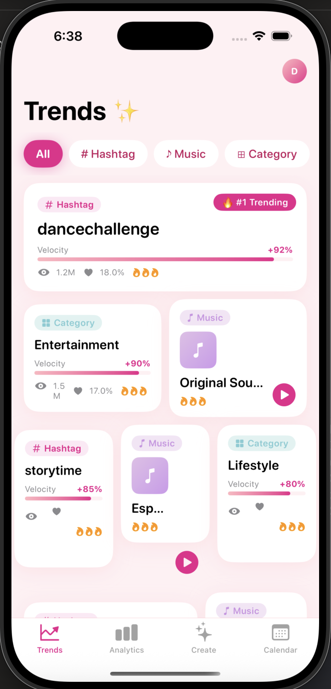
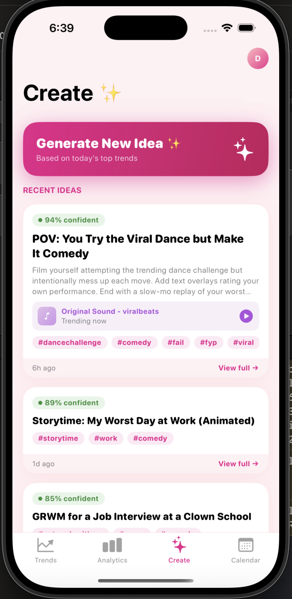
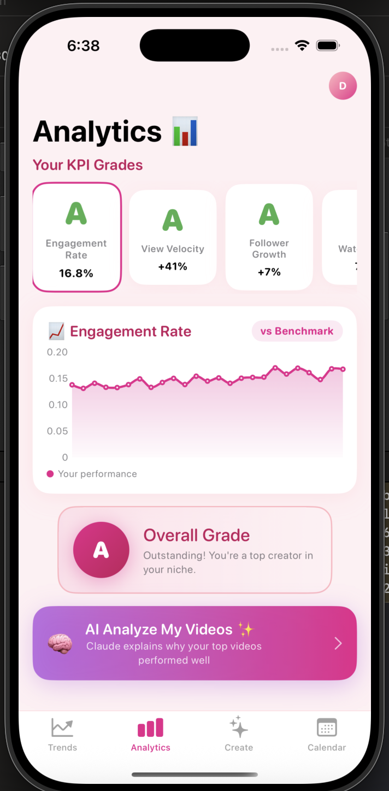
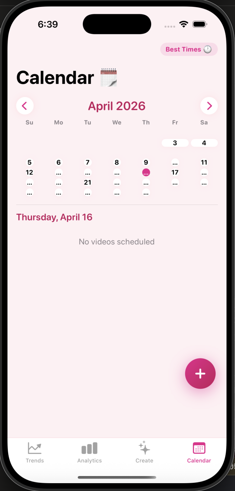
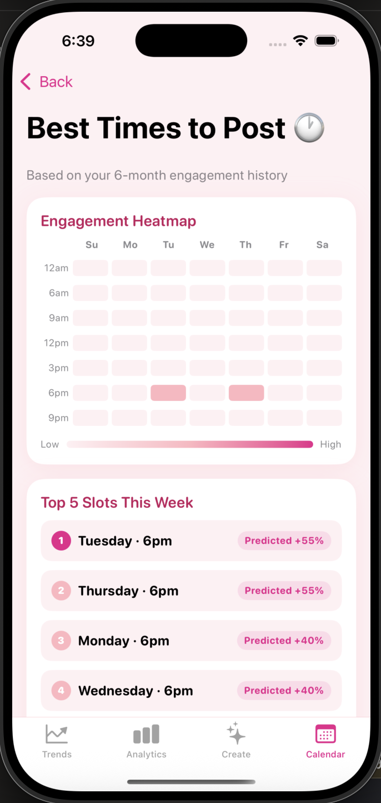

# TikTok Trends Dashboard

A full-stack app I built to help TikTok creators stop guessing what to post. It pulls live trend data from TikTok, compares your account stats against platform benchmarks, and uses Claude (Anthropic's AI) to suggest actual video ideas based on what's trending right now.

<p align="center">
  
</p>

---

## ▶ Try the demo (no install)

The iOS app runs in your browser via [Appetize.io](https://appetize.io) — no Xcode or iPhone needed.

> **Live demo:** _link will appear here once deployed — see [Deploying the demo](#deploying-the-demo)_

Tap **Try Demo** on the login screen to skip TikTok OAuth and explore with seeded data (20 trends, 25 weeks of analytics, 3 AI recommendations). Sessions are capped at 3 minutes by Appetize's free tier; first request after backend sleep takes ~25s while it cold-starts.

---

## What it does

**Trending Now** — shows what's gaining traction on TikTok right now, broken into hashtags, music, and content categories. Each trend has a velocity score that measures week-over-week growth, so you can see not just what's popular but what's *accelerating*. No login needed to browse this.


**AI Video Concepts** — hit Generate and it takes the top trending hashtags, combines them with your niche, and sends it to Claude to generate a full video idea: title, what to film, which sound to use, and which hashtags to put in the caption.



**Performance Analytics** — connects to your TikTok account and tracks your engagement rate, view velocity, follower growth, watch time, and share rate over the past 6 months. Plots them on a chart against platform averages so you can actually see how you're doing, and grades each metric A–F.



**Content Calendar** — schedule the videos you want to film, see them on a month grid, and tap **Best Times** for a heatmap of when your audience is actually online based on your last 6 months of engagement.

<p>
  
  
</p>

You sign in with your TikTok account (OAuth) so your real data gets pulled on login. There's also a demo mode if you just want to click around without connecting an account.

---

## Quick start

Make sure PostgreSQL and Redis are running, then:

```bash
# 1. Create the database
psql -U postgres -c "CREATE DATABASE tiktok_trends;"

# 2. Set your secrets
export DB_PASSWORD=...
export JWT_SECRET=...
export ANTHROPIC_API_KEY=...
export TIKTOK_CLIENT_KEY=...
export TIKTOK_CLIENT_SECRET=...

# 3. Start the backend (runs Flyway migrations automatically)
cd tiktok-trends-api
mvn spring-boot:run

# 4. In a new terminal, start the frontend
cd tiktok-trends-ui
npm install && npm run dev
```

Once both are running:

| | URL |
|---|---|
| **Frontend (app)** | http://localhost:3000 |
| **Backend API** | http://localhost:8080 |
| **Swagger / API docs** | http://localhost:8080/swagger-ui.html |

Hit **Try Demo** on the landing page to explore the full app without a TikTok account — no credentials needed.

---

## Tech stack

| | |
|---|---|
| Frontend | React 18 + Vite + Tailwind CSS |
| Backend | Java 21 + Spring Boot 3.2 |
| Database | PostgreSQL + Flyway |
| Cache | Redis |
| AI | Claude API (`claude-sonnet-4-20250514`) |
| Auth | TikTok OAuth 2.0 + JWT |
| Data | TikTok Research API |

---

## How it's structured

```
React (localhost:3000)
        │
        ▼
Spring Boot API (localhost:8080)
        │
   ┌────┴──────────────────────┐
   │                           │
Ingestion Scheduler       Recommendation Engine
(runs every 2h)           (on demand)
   │                           │
TikTok Research API       Claude API
   │                           │
PostgreSQL ◄───────────────────┘
   │
Redis Cache
```

A background job runs every 2 hours, fetches recent videos from the TikTok Research API, aggregates them into trend records, and computes platform-wide KPI benchmarks. For each connected user, it also refreshes their account stats and auto-grades them against the latest benchmarks. Trend queries are cached in Redis for 1 hour.

---

## Running locally

**Prerequisites:** Java 21, Maven, PostgreSQL, Redis, Node 18+, Anthropic API key

**1. Create the database**
```bash
psql -U postgres -c "CREATE DATABASE tiktok_trends;"
```

**2. Set env variables**
```bash
export DB_PASSWORD=...
export JWT_SECRET=...          # min 32 chars
export ANTHROPIC_API_KEY=...
export TIKTOK_CLIENT_KEY=...
export TIKTOK_CLIENT_SECRET=...
```

**3. Start the backend**
```bash
cd tiktok-trends-api
mvn spring-boot:run
# http://localhost:8080
# Swagger: http://localhost:8080/swagger-ui.html
```

**4. Start the frontend**
```bash
cd tiktok-trends-ui
npm install
npm run dev
# http://localhost:3000
```

If you don't have a TikTok developer app set up, just use demo mode — it works without any TikTok credentials.

---

## API endpoints

| Method | Endpoint | Auth | |
|--------|----------|------|-|
| GET | `/api/v1/auth/tiktok/authorize` | — | TikTok OAuth URL |
| POST | `/api/v1/auth/tiktok/callback` | — | Exchange code → JWT |
| POST | `/api/v1/auth/demo` | — | Demo login |
| GET | `/api/v1/trends/hashtags` | — | Hashtag trends |
| GET | `/api/v1/trends/music` | — | Music trends |
| GET | `/api/v1/trends/categories` | — | Category trends |
| POST | `/api/v1/recommendations` | JWT | Generate video concept |
| GET | `/api/v1/recommendations` | JWT | Past recommendations |
| GET | `/api/v1/analytics/performance` | JWT | KPI history + grades |

---

## DB schema

| Table | What's in it |
|-------|-------------|
| `users` | Accounts + TikTok OAuth tokens |
| `videos` | Videos pulled from TikTok Research API |
| `trends` | Aggregated hashtag / music / category trend signals |
| `recommendations` | AI-generated video concepts per user |
| `user_performance_snapshots` | Weekly KPI snapshots |
| `trend_benchmarks` | Platform-wide weekly averages |
| `user_kpi_grades` | A–F grades per snapshot |

---

## Build status

| Phase | | Status |
|-------|--|--------|
| 1 | DB schema + Spring Boot + JWT auth | ✅ |
| 2 | TikTok Research API ingestion + CRON | ✅ |
| 3 | Trend engine + Redis caching | ✅ |
| 4 | AI recommendations via Claude | ✅ |
| 5 | React frontend | ✅ |
| 6 | Swagger docs + demo mode + tests | ✅ |

---

## Deploying the demo

The public demo is two pieces hosted on free tiers: the Spring Boot backend on **Render** and the iOS app streamed in a browser via **Appetize.io**. The whole setup costs $0/month.

### 1. Backend → Render

1. Sign up at [render.com](https://render.com) (GitHub login is fine, no credit card required for the free tier).
2. **New → Blueprint** → connect this repo. Render will detect [`TikTok/tiktok-trends-api/render.yaml`](TikTok/tiktok-trends-api/render.yaml) and create a `tiktok-trends-api` web service from the included `Dockerfile`.
3. First build takes ~3–5 minutes. When it's green, copy the public URL — it'll be `https://tiktok-trends-api.onrender.com` (or similar).
4. **Keep it warm**: free tier sleeps after 15 min idle (~25s cold start). Set up a free [UptimeRobot](https://uptimerobot.com) HTTP monitor pointed at `https://YOUR-RENDER-URL.onrender.com/actuator/health` on a 5-minute interval.

### 2. iOS app → Appetize.io

The iOS `APIClient` already swaps to the Render URL in Release builds (`#if DEBUG` toggles between localhost and prod). If your Render URL differs from the default, edit [`TikTok/tiktok-trends-ios/TikTokTrends/Core/Network/APIClient.swift`](TikTok/tiktok-trends-ios/TikTokTrends/Core/Network/APIClient.swift) before building.

```bash
cd TikTok/tiktok-trends-ios
./build-for-appetize.sh
# → produces build/TikTokTrends-appetize.zip
```

Then:

1. Sign up at [appetize.io](https://appetize.io) (free tier: 100 min/month, 3-min sessions, watermark).
2. Drag `build/TikTokTrends-appetize.zip` into the upload page.
3. Pick an iPhone 15/16 device, iOS 17+.
4. Copy the **public link** Appetize gives you and paste it into the "Live demo" callout near the top of this README.

### 3. What the recruiter does

Clicks the Appetize link → iOS sim loads in their browser → taps **Try Demo** → 3 minutes to explore Trends, Analytics, Create, Calendar.
